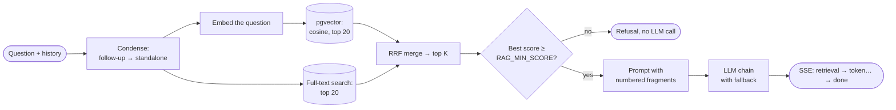

# SkyDental — a RAG support assistant for a dental clinic

**English** · [Oʻzbekcha](README.uz.md) · [Русский](README.ru.md)

A course project about **Retrieval-Augmented Generation (RAG)**. It is the landing page of a dental
clinic in Tashkent (Russian and Uzbek), with a chat assistant that answers **only from the clinic's
knowledge base**. The chat shows every step of how it found an answer: which fragments it
retrieved and with what scores, which of them went into the prompt, which model answered, and
whether it had to fall back to another model.

| Layer | What is used |
| --- | --- |
| Frontend | Vite 7, React 19 and TypeScript; RU and UZ; light and dark themes; no external images or web fonts |
| Backend | Node and TypeScript on [Hono](https://hono.dev), deployed as one Vercel function (`/api/*`) |
| Database | Postgres with pgvector: [Neon](https://neon.tech) in production, embedded [PGlite](https://pglite.dev) locally (no Docker or cloud needed) |
| LLM | A provider layer with an automatic fallback chain. Gemini by default, **light models only** (Flash-Lite and Flash with minimal reasoning). OpenAI, OpenRouter, Groq, DeepSeek, Anthropic and Ollama each need one env variable |
| Admin panel | Feedback and traces, knowledge gaps, stats, a knowledge-base editor with versions and export, model status, a retrieval sandbox |
| Eval | 35 golden questions; hit@k, MRR and refusal accuracy; threshold tuning; an optional LLM judge |

## Contents

- [What RAG looks like in the chat](#what-rag-looks-like-in-the-chat)
- [How the pipeline works](#how-the-pipeline-works)
- [Quick start](#quick-start)
- [Environment variables](#environment-variables)
- [LLM providers and fallback](#llm-providers-and-fallback)
- [Admin panel](#admin-panel)
- [Eval](#eval)
- [Deploying to Vercel and Neon](#deploying-to-vercel-and-neon)
- [Project structure](#project-structure)
- [Knowledge base](#knowledge-base)
- [Clinic data](#clinic-data)
- [Design and motion](#design-and-motion)

## What RAG looks like in the chat

Ask *"How much is a dental implant?"*. The answer arrives token by token with numbered citations
`[1]`, `[2]`. Clicking a citation shows the quoted fragment and its source.

Every answer has a **"How I found the answer"** panel:

| What you see | What it means |
| --- | --- |
| The original and the rewritten question | Follow-ups like *"and how much is it?"* are rewritten into standalone questions before the search |
| Top-k fragments with vector, text and RRF scores, plus an "in prompt" mark | Hybrid search by meaning and by keywords, merged with Reciprocal Rank Fusion |
| Similarity threshold and best match | Below the threshold the bot refuses without calling the LLM at all |
| Model, fallback attempts, timings, tokens | Which model answered, and what happened before it did |

**Student mode** (the toggle in the chat header) opens the full trace and adds a button: *"Ask
the same model without the knowledge base"*. The second answer appears under the first so you can
compare them. Without RAG, the model usually makes up prices.

Refusals come with the reason, for example: *"Best match 0.41 is below the threshold 0.60: there
is no suitable fragment in the base."*

👍 and 👎 feedback, with an optional comment after 👎, is saved to the database. It appears in the
admin panel next to the full trace of that answer.

## How the pipeline works



1. **Indexing** (`server/rag/ingest.ts`). `shared/chunker.ts` cuts markdown documents into
   chunks. One `## section` becomes one chunk, and so does one table row, so that each price line
   can be found on its own. Each chunk gets a hash of *embedding model + text*. When a document is
   saved, only chunks with a new hash are re-embedded. Fix one price and one vector is
   recalculated, not the whole price list. Embeddings come from `gemini-embedding-001`, 768
   dimensions.
2. **Condensing** (`server/rag/answer.ts`). When there is a chat history, a light model rewrites a
   follow-up into a standalone question. The search and the prompt use the rewritten question, and
   the trace shows both versions.
3. **Hybrid retrieval** (`server/rag/retrieve.ts`). One SQL query covers both languages. It runs a
   vector search (cosine, top 20) and a Postgres full-text search on word stems (top 20), then
   merges them with RRF (k = 60). RRF adds up ranks rather than raw scores, because the two
   searches use different scales. A question in Uzbek can find a Russian fragment. Two small
   bonuses break ties: fragments in the question's language, and price documents when the question
   is about prices.
4. **Threshold.** If the best cosine similarity is below `RAG_MIN_SCORE`, the bot refuses right
   away, and the refusal includes both numbers.
5. **Prompt** (`server/rag/prompt.ts`). The instruction is in the user's language: answer only
   from the numbered fragments, cite them as `[n]`, and reply with the `NO_ANSWER` marker when
   the answer is not there.
6. **Generation** goes through the model chain (`server/llm/chain.ts`) and is streamed.
7. **Protocol** (`shared/protocol.ts`). The chat receives Server-Sent Events: `retrieval`, then
   `token` events, then `done`, which carries the trace id, sources, model, attempts, timings and
   token usage. An `error` event replaces `done` on failure.
8. **Traces.** Every question is stored in `chat_traces` and every rating in `feedback`. IP
   addresses are never stored. The rate limiter keeps only a salted hash.

## Quick start

You need Node.js 22 or newer.

```bash
npm install
cp .env.example .env
```

There are three ways to run the project.

### A. Demo in the browser, no server

Set `VITE_RAG_ENDPOINT=` (empty) in `.env` and run `npm run dev:web`. The chat answers in the
browser from the same markdown files, using simple word matching. It emits the same events and
shows the same trace, with a "Demo mode" badge.

### B. Full stack, offline, no keys

Put this in `.env`:

```ini
LLM_CHAIN=local:extractive
EMBED_PROVIDER=local
EMBED_MODEL=hash-768
RAG_MIN_SCORE=0.15
ADMIN_PASSWORD=admin
```

Then index the knowledge base and start the site and the API:

```bash
npm run seed
npm run dev
```

The site runs at http://localhost:5173, the API at http://localhost:8787 (Vite proxies `/api`
there), and the admin panel at http://localhost:5173/admin.html. The `local` provider answers with
the best-matching fragment, and `hash-768` is a toy embedding. This mode is good for working on the
interface, but not for judging answer quality.

### C. With Gemini

Get a key in [Google AI Studio](https://aistudio.google.com/apikey) and set `GEMINI_API_KEY` in
`.env`. Keep the default `LLM_CHAIN` and `EMBED_*`, then:

```bash
npm run seed
npm run dev
```

> **PGlite runs in a single process.** Stop `npm run dev` before running `npm run seed` or
> `npm run eval` against the local database. Neon has no such limit.

### Scripts

| Command | What it does |
| --- | --- |
| `npm run dev` | Vite and the API together (`dev:web` and `dev:api` run them separately) |
| `npm run build` | Type-checks the frontend and the server, then builds into `dist/` |
| `npm run db:migrate` | Applies `server/db/schema.sql` to the database in `DATABASE_URL` |
| `npm run seed` | Loads `content/rag/{ru,uz}/*.md` into the database and indexes them. Documents already in the database are left alone |
| `npm run seed -- --force` | Overwrites documents with the markdown files. Each overwrite becomes a new version, and the old ones stay in the history |
| `npm run seed -- --reindex` | Rebuilds the index of all documents, for example after changing `EMBED_MODEL` |
| `npm run eval` | Retrieval metrics on the golden set. See [Eval](#eval) |

## Environment variables

Everything is described in [`.env.example`](.env.example). The main variables:

| Variable | Default | Purpose |
| --- | --- | --- |
| `VITE_RAG_ENDPOINT` | `/api/chat` | Where the chat sends questions. Empty means demo mode in the browser. Read at **build** time |
| `DATABASE_URL` | empty | Neon connection string (pooled). Empty means PGlite in `.data/`, which works only locally |
| `GEMINI_API_KEY` and other `*_API_KEY` | empty | A provider is connected only when its key is set |
| `OLLAMA_BASE_URL` | empty | A local Ollama server, e.g. `http://localhost:11434/v1` |
| `LLM_CHAIN` | Gemini Flash-Lite → Flash-Lite → Flash | The model chain in priority order, `provider:model,provider:model` |
| `GEMINI_THINKING_LEVEL` | `minimal` | Reasoning level for Gemini 3: `minimal`, `low` or `off` |
| `EMBED_PROVIDER`, `EMBED_MODEL` | `gemini`, `gemini-embedding-001` | Embeddings. Changing them requires a reindex |
| `RAG_TOP_K` | `5` | How many fragments go into the prompt |
| `RAG_MIN_SCORE` | `0.6` | Similarity threshold for refusing. Tune it with `npm run eval` |
| `ADMIN_PASSWORD` | empty | Admin password. Empty disables the admin panel |
| `ADMIN_SECRET` | derived | Secret for signing the admin cookie. Generate one: `openssl rand -hex 32` |
| `IP_SALT` | dev value | Salt for hashing IP addresses. Set your own in production |
| `RATE_LIMIT_MAX`, `RATE_LIMIT_WINDOW_SEC` | `20`, `600` | Chat questions allowed per IP per window |

## LLM providers and fallback

`LLM_CHAIN` lists models in priority order. A request goes to the first available model and moves
down the chain when a model fails:

| What happened | What the chain does |
| --- | --- |
| 429, 5xx, "overloaded", timeout (15 s to the first token) | Tries the next model. The failed one is paused for 60 s, or for as long as `Retry-After` says |
| 401 or 403 | Pauses the whole provider for 10 minutes |
| The provider does not have this model | Pauses the model for an hour. At start-up the chain also checks the provider's model list, cached for an hour |
| 400 or another request error | Returns the error without fallback, because the next model would fail the same way |

Fallback is only possible **before the first token**. If a model starts answering and then breaks
off, the chat gets an error, because gluing one answer together from two models would be wrong.
The pauses are kept in the function's memory. Every attempt goes into the trace (`attempts`), and
the admin panel shows the state of each model and has a **Ping** button.

A chain can mix providers, for example when the Gemini free quota runs out:

```ini
LLM_CHAIN=gemini:gemini-3.5-flash-lite,gemini:gemini-3.5-flash,groq:llama-3.1-8b-instant
```

Model names change often. Check them in the provider's list, and use **Ping** in the admin panel to
test each one.

To see fallback without any keys, use `LLM_CHAIN=local:fail-429,local:extractive`. The first model
always reports overload, the second one answers, and the trace shows both attempts.

To add another OpenAI-compatible provider, add one entry to `server/llm/registry.ts` with the API
address and the variable that holds the key.

## Admin panel

The admin panel is at `/admin.html` locally and at `/admin` on Vercel. It is a separate Vite entry,
so it does not add weight to the landing page. The password comes from `ADMIN_PASSWORD`. The
session is an httpOnly cookie signed with HMAC and valid for 7 days.

| Section | What is there |
| --- | --- |
| Dialogs and feedback | All questions with filters: rated, 👎, 👍, with a comment, unanswered; RAG or no-RAG mode. Click one to open its full trace |
| Knowledge gaps | Questions the bot could not answer, grouped by shared word stems, with an "Add to the base" button |
| Stats | Share of 👍, share of refusals, answers per model, fallbacks, p50 and p95 latency |
| Knowledge base | Documents by language and a markdown editor with a live preview of the chunking. Saving creates a new version and reindexes only the changed chunks. Includes version history with diff and rollback, and export to `.md` or `.zip` |
| Models | The chain, each model's state and pause, Ping, embedding state and "Reindex all" |
| Sandbox | Ask a question and see the retrieval and the finished prompt without generating an answer. Handy in class |

## Eval

`eval/golden.json` holds 35 questions: in Russian, in Uzbek, across languages (a question in one
language whose answer is in the other), follow-ups with a history, and questions that are
deliberately outside the knowledge base. Each question lists the expected sources or
`expectRefusal`.

```bash
npm run eval                                      # retrieval only, no answers generated
npm run eval -- --judge                           # also generates answers and has an LLM judge them
npm run eval -- --judge=gemini:gemini-3.5-flash   # the judge is a specific model
```

The report goes to the console and to `eval/report.md`:

- **hit@k**: the share of questions where the expected fragment is among the first k;
- **MRR**: the mean of 1 / rank of the first expected fragment;
- **refusal accuracy**: out-of-base questions refused, in-base questions answered;
- **threshold sweep**: accuracy for every `RAG_MIN_SCORE` from 0 to 1, with a recommended value;
- **judge**: whether the answer follows the fragments (*faithful*) and whether it answers the
  question (*relevant*).

Eval uses the same database and embedding model as the server, so run `npm run seed` first. With
offline `hash-768` embeddings the numbers are only a smoke test. Measure real quality with Gemini.

## Deploying to Vercel and Neon

1. **Neon.** Create a project at [neon.tech](https://neon.tech) and copy the **pooled** connection
   string. The pgvector extension is created by the schema itself.
2. **Schema and data.** Run these once from your machine:

   ```bash
   DATABASE_URL="postgres://…" npm run db:migrate
   DATABASE_URL="postgres://…" GEMINI_API_KEY=… npm run seed
   ```

   Or put the same values in `.env` and run `npm run db:migrate` and `npm run seed`.
3. **Vercel.** Import the repository. `vercel.json` already sets the Vite build, the output folder
   and the rewrite of `/api/*` into one function (`api/index.ts`, up to 60 s).
4. **Environment variables** go in *Project Settings → Environment Variables*: `DATABASE_URL`,
   `GEMINI_API_KEY`, `VITE_RAG_ENDPOINT=/api/chat`, `ADMIN_PASSWORD`, `ADMIN_SECRET` and
   `IP_SALT`, plus `LLM_CHAIN` and `RAG_MIN_SCORE` if you changed them. `VITE_RAG_ENDPOINT` is
   baked in at build time, so redeploy after changing it.
5. **Check** `https://<project>.vercel.app/api/health`. It shows the database, the number of chunks,
   whether a reindex is needed, the connected providers and the chain state. Then open the chat
   and the admin panel at `/admin`.

On Vercel the schema is not applied automatically. Run `npm run db:migrate` whenever
`schema.sql` changes.

## Project structure

```
api/index.ts            Vercel entry: every /api/* request goes to Hono
server/
├── app.ts              /api/chat (SSE), /api/feedback, /api/health, /api/admin/*
├── dev.ts, env.ts      local API server; env validation (zod)
├── db/                 schema.sql and the client: postgres.js (Neon) or PGlite
├── llm/                providers (gemini, openaiCompat, anthropic, local), registry, fallback chain
├── rag/                ingest, retrieve, prompt, answer: the RAG pipeline
├── admin/              admin routes, auth, zip export
└── rateLimit.ts
shared/                 code shared by the frontend and the server
├── chunker.ts          markdown → chunks (demo bot, server and admin preview)
├── protocol.ts         request, SSE event and trace types
└── sse.ts, text.ts     SSE parsing; word stems for keyword search
scripts/                migrate, seed, eval
eval/golden.json        eval questions
content/rag/{ru,uz}/    starting knowledge base (seed)
src/
├── components/chat/    ChatWidget, useChat, ragClient, RetrievalTrace, AnswerText, demo bot
├── admin/              admin panel (separate entry admin.html)
├── i18n/               ru.ts, uz.ts: every text on the site
├── styles/, graphics/  tokens, sections, glass; girih pattern, crown, icons
├── theme/              light, dark and auto
└── config.ts           Telegram and map links
```

## Knowledge base

The starting data lives in plain markdown:

```
content/rag/
├── ru/{prices,faq,schedule}.md
└── uz/{prices,faq,schedule}.md
```

`npm run seed` loads these files into the database. From then on the **database is the source of
truth**. Edit the knowledge base in the admin panel, where every save is a version you can roll
back to. To get the files out, use export. A repeated `npm run seed` does not touch documents that
are already in the database, unless you pass `--force`.

The chunker relies on two structures:

- `# Title` is the document name and goes into the source label;
- `## Section` becomes one chunk;
- **a table row** becomes a separate chunk, with the first column in the source label. This matters
  for the price list: otherwise every position would stick together into one chunk.

The phone, house number and floor in `schedule.md` are the same `__` placeholders as on the site,
so the bot never gives a number that isn't on the page.

## Clinic data

Texts, prices, the phone number and the address live in `src/i18n/ru.ts` and `src/i18n/uz.ts`.
Change both files. If a key is added to one dictionary and forgotten in the other, `npm run build`
fails, so an untranslated text never reaches the site.

| What | Where |
| --- | --- |
| Telegram link, map link | `src/config.ts` |
| SEO: address, phone, hours | the JSON-LD block and meta tags in `index.html` |
| Answers of the chat bot | the knowledge base (admin panel or `content/rag/` before seeding) |

> All numbers are currently **placeholders**: prices, the opening year and the rating. Replace them
> with real ones before publishing.

Three fields are deliberately left without plausible-looking values, so nobody mistakes them for
real ones. On the site they have a dashed underline and a "demo data" hint:

| Field | Dictionary key | What to do |
| --- | --- | --- |
| End of the address | `contacts.address` | put the house and floor instead of `__` |
| Phone | `contacts.phone` and `contacts.phoneHref` | the visible number and the digits for `tel:` |
| License number | `footer.license` | the number instead of `__-____` |

While `phoneHref` is empty, `components/PhoneLink.tsx` shows the phone as **text, not a link**,
because `tel:` would lead nowhere. Once the digits are there, all four places turn into links by
themselves.

**Booking form.** There is no booking backend yet. The form validates the name and the phone
(`+998` and 9 digits), copies the request to the clipboard and opens the clinic's Telegram. When an
endpoint appears, replace the body of `onSubmit` in `components/Contacts.tsx` with a `fetch()`.

## Design and motion

The design follows the Apple Human Interface Guidelines, translated to the web
([apple-design](https://github.com/dickwu/apple-design-skill) skill):

- **Palette.** Cobalt and turquoise from Uzbek glazed majolica. A tile glaze and dental porcelain
  are essentially the same material. Contrast is calculated to WCAG from the actual hex values: body
  text 17.4:1, secondary text and accent 5.9:1. Turquoise (3.1:1) is used only in graphics.
- **Glass** only on the functional layer: the header and the chat panel. Content cards are
  solid.
- **Theme.** Auto (follows the system), light or dark. The choice is saved in `localStorage` and
  applied before the first paint, so there is no flash.
- **Girih pattern** under the whole page. It is at full strength under the hero and becomes a light
  texture further down. The tiles move at 0.15 of the scroll speed, which gives a far parallax
  plane (scroll-driven animations).
- **Motion.** Segmented controls have a sliding thumb on a spring (`linear()`). A new theme opens
  as a circle from the button (View Transitions). FAQ answers open and close by height
  (`interpolate-size`). The header settles during the first 96 px of scrolling. Hero lines and
  section cards appear one after another. The chat grows out of its button on a spring.
- **Accessibility.** The site respects reduce motion, reduce transparency and increase contrast.
  Tap targets are at least 44 px, keyboard focus is visible, and the chat is a modal with a focus
  trap that closes on `Esc`.
