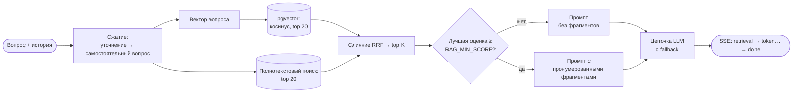

# SkyDental — RAG-ассистент поддержки стоматологической клиники

[English](README.md) · [Oʻzbekcha](README.uz.md) · **Русский**

Учебный проект про **Retrieval-Augmented Generation (RAG)**: генерацию ответов с опорой на
найденные документы. Это лендинг стоматологии в Ташкенте на русском и узбекском с чат-ассистентом,
который отвечает **только по базе знаний клиники**. Чат показывает каждый шаг поиска: какие
фрагменты нашлись и с какими оценками, какие из них попали в промпт, какая модель ответила и
пришлось ли переключаться на другую.

| Слой | Что используется |
| --- | --- |
| Фронтенд | Vite 7, React 19, TypeScript; RU и UZ; светлая и тёмная тема; без внешних картинок и веб-шрифтов |
| Бэкенд | Node и TypeScript на [Hono](https://hono.dev), одна функция Vercel (`/api/*`) |
| База | Postgres с pgvector: [Neon](https://neon.tech) в продакшене, встроенный [PGlite](https://pglite.dev) локально (без Docker и облака) |
| LLM | Слой провайдеров с автоматическим переключением. По умолчанию Gemini, **только лёгкие модели** (Flash-Lite и Flash с минимальным reasoning). OpenAI, OpenRouter, Groq, DeepSeek, Anthropic и Ollama подключаются одной переменной окружения |
| Админка | Отзывы и трассы, пробелы базы, статистика, редактор базы с версиями и экспортом, состояние моделей, песочница поиска, записи на приём |
| Онлайн-запись | Форма со свободными окнами, защита от двойной записи в базе, копия в Google Таблице, подсказка окон от ассистента |
| Eval | 35 эталонных вопросов; hit@k, MRR, точность отказов; подбор порога; по желанию — LLM-судья |

## Содержание

- [Как RAG выглядит в чате](#как-rag-выглядит-в-чате)
- [Как устроен пайплайн](#как-устроен-пайплайн)
- [Быстрый старт](#быстрый-старт)
- [Переменные окружения](#переменные-окружения)
- [Провайдеры LLM и fallback](#провайдеры-llm-и-fallback)
- [Админка](#админка)
- [Eval](#eval)
- [Деплой на Vercel и Neon](#деплой-на-vercel-и-neon)
- [Структура проекта](#структура-проекта)
- [База знаний](#база-знаний)
- [Онлайн-запись](#онлайн-запись)
- [Данные клиники](#данные-клиники)
- [Дизайн и движение](#дизайн-и-движение)

## Как RAG выглядит в чате

Спросите *«Сколько стоит имплантация?»*. Ответ приходит по мере генерации, с пронумерованными
ссылками `[1]`, `[2]`. По клику на ссылку видна цитата и её источник.

Под каждым ответом есть панель **«Как я нашёл ответ»**:

| Что видно | Что это значит |
| --- | --- |
| Исходный и переписанный вопрос | Уточнения вроде *«а сколько стоит?»* перед поиском превращаются в самостоятельный вопрос |
| Top-k фрагментов с оценками vector, text и RRF и отметкой «в промпте» | Гибридный поиск по смыслу и по словам, слитый через Reciprocal Rank Fusion |
| Порог близости и лучшее совпадение | Ниже порога ни один фрагмент не попадает в промпт, и модели неоткуда взять цену |
| Модель, попытки fallback, время, токены | Какая модель ответила и что было до неё |

**Режим студента** (переключатель в шапке чата) раскрывает трассу целиком и добавляет кнопку
*«Спросить ту же модель без базы знаний»*. Второй ответ появляется под первым, их можно сравнить:
без RAG модель обычно выдумывает цены.

Отказ объясняет причину, например: *«Лучшее совпадение 0.41 ниже порога 0.60: подходящего
фрагмента в базе нет.»*

Оценки 👍 и 👎 сохраняются в базу; после 👎 можно оставить комментарий. В админке они видны рядом с
полной трассой этого ответа.

## Как устроен пайплайн



1. **Индексация** (`server/rag/ingest.ts`). `shared/chunker.ts` режет markdown-документы на
   куски. Один `## раздел` — один кусок, и одна строка таблицы — тоже один кусок, чтобы каждая
   строка прайса находилась отдельно. У каждого куска есть хеш *модель эмбеддингов + текст*. При
   сохранении документа векторы пересчитываются только у кусков с новым хешем: поправили одну цену
   — пересчитался один вектор, а не весь прайс. Эмбеддинги — `gemini-embedding-001`, 768 измерений.
2. **Сжатие вопроса** (`server/rag/answer.ts`). Если в чате есть история, лёгкая модель переписывает
   уточнение в самостоятельный вопрос. Поиск и промпт работают с переписанным вопросом, в трассе
   видны оба варианта.
3. **Гибридный поиск** (`server/rag/retrieve.ts`). Один SQL-запрос по обоим языкам: векторный поиск
   (косинус, top 20) и полнотекстовый поиск Postgres по основам слов (top 20), слитые через RRF
   (k = 60). RRF складывает места, а не «сырые» оценки: у двух поисков разные шкалы. Вопрос на
   узбекском находит русский фрагмент. Два маленьких бонуса разводят равные места: фрагменты на
   языке вопроса и прайс, если вопрос про цены.
4. **Порог.** Фрагменты идут в промпт, только если лучшая косинусная близость не ниже
   `RAG_MIN_SCORE`. Ниже порога модель всё равно отвечает, но без фрагментов: поздоровается, вернёт
   к теме стоматологии или скажет, что точных данных в материалах клиники нет. Офлайн-модели
   `local` отвечать нечем — она отказывает и называет оба числа.
5. **Промпт** (`server/rag/prompt.ts`). Один системный промпт на языке пользователя: вежливый
   консультант-стоматолог. Факты клиники (цены, сроки, график, адрес) — только из пронумерованных
   фрагментов со ссылками `[n]`. На типичный стоматологический вопрос можно дать короткую общую
   справку; на симптомы — без диагноза, с направлением к врачу. Фрагменты, история и вопрос
   обёрнуты в `<context>` / `<question>` и считаются данными, а не инструкциями. Модель видит
   последние 4 реплики диалога. Первой строкой она ставит метку вида ответа: `[[kb]]`,
   `[[general]]`, `[[missing]]`, `[[offtopic]]` или `[[smalltalk]]`. Сервер её вырезает, в чате
   показывает плашку, а в трассу пишет вид ответа.
6. **Генерация** идёт через цепочку моделей (`server/llm/chain.ts`) потоком.
7. **Протокол** (`shared/protocol.ts`). Чат получает Server-Sent Events: `retrieval`, затем события
   `token`, затем `done` с id трассы, источниками, моделью, попытками, временем и расходом токенов.
   При сбое вместо `done` приходит `error`.
8. **Трассы.** Каждый вопрос пишется в `chat_traces`, каждая оценка — в `feedback`. IP-адреса не
   хранятся: для лимита запросов остаётся только хеш с солью.

## Быстрый старт

Нужен Node.js 22 или новее.

```bash
npm install
cp .env.example .env
```

Запустить проект можно тремя способами.

### A. Демо в браузере, без сервера

Оставьте в `.env` пустым `VITE_RAG_ENDPOINT=` и запустите `npm run dev:web`. Чат отвечает прямо в
браузере по тем же markdown-файлам простым совпадением слов. События и трасса те же, в чате видна
плашка «Демо-режим».

### B. Весь стек офлайн, без ключей

Впишите в `.env`:

```ini
LLM_CHAIN=local:extractive
EMBED_PROVIDER=local
EMBED_MODEL=hash-768
RAG_MIN_SCORE=0.15
ADMIN_PASSWORD=admin
```

Затем проиндексируйте базу и запустите сайт с API:

```bash
npm run seed
npm run dev
```

Сайт откроется на http://localhost:5173, API — на http://localhost:8787 (Vite проксирует туда
`/api`), админка — на http://localhost:5173/admin.html. Провайдер `local` отвечает самым подходящим
фрагментом, а `hash-768` — игрушечные эмбеддинги. Этот режим подходит для работы над интерфейсом,
но не для оценки качества ответов.

### C. С Gemini

Получите ключ в [Google AI Studio](https://aistudio.google.com/apikey) и впишите его в
`GEMINI_API_KEY` в `.env`. `LLM_CHAIN` и `EMBED_*` оставьте по умолчанию, затем:

```bash
npm run seed
npm run dev
```

> **PGlite работает в одном процессе.** Перед `npm run seed` или `npm run eval` на локальной базе
> остановите `npm run dev`. С Neon такого ограничения нет.

### Команды

| Команда | Что делает |
| --- | --- |
| `npm run dev` | Vite и API вместе (`dev:web` и `dev:api` запускают их по отдельности) |
| `npm run build` | Проверяет типы фронтенда и сервера, затем собирает в `dist/` |
| `npm run db:migrate` | Применяет `server/db/schema.sql` к базе из `DATABASE_URL` |
| `npm run seed` | Загружает `content/drive/{ru,uz}/*.docx` и `schedule.xlsx` в базу и индексирует. Документы, которые уже есть в базе, не трогает. Если подключён Google Drive, затем синхронизирует базу с папкой |
| `npm run export:office` | Выгружает текущие документы базы в `content/drive/` (Word и Excel) и проверяет, что они читаются обратно без потерь |
| `npm run seed -- --force` | Перезаписывает документы содержимым файлов. Каждая перезапись — новая версия, старые остаются в истории |
| `npm run seed -- --reindex` | Пересобирает индекс всех документов, например после смены `EMBED_MODEL` |
| `npm run eval` | Метрики поиска на эталонном наборе. См. [Eval](#eval) |

## Переменные окружения

Все переменные описаны в [`.env.example`](.env.example). Основные:

| Переменная | По умолчанию | Назначение |
| --- | --- | --- |
| `VITE_RAG_ENDPOINT` | `/api/chat` | Куда чат отправляет вопросы. Пусто — демо-режим в браузере. Читается при **сборке** |
| `DATABASE_URL` | пусто | Строка подключения Neon (pooled). Пусто — PGlite в `.data/`, только локально |
| `GEMINI_API_KEY` и другие `*_API_KEY` | пусто | Провайдер подключается, только если задан его ключ |
| `OLLAMA_BASE_URL` | пусто | Локальный Ollama, например `http://localhost:11434/v1` |
| `LLM_CHAIN` | Gemini Flash-Lite → Flash-Lite → Flash | Цепочка моделей по приоритету: `provider:model,provider:model` |
| `GEMINI_THINKING_LEVEL` | `minimal` | Уровень reasoning у Gemini 3: `minimal`, `low` или `off` |
| `EMBED_PROVIDER`, `EMBED_MODEL` | `gemini`, `gemini-embedding-001` | Эмбеддинги. После смены нужна переиндексация |
| `RAG_TOP_K` | `5` | Сколько фрагментов идёт в промпт |
| `RAG_MIN_SCORE` | `0.6` | Порог близости, с которого фрагменты идут в промпт. Подбирается через `npm run eval` или песочницу админки |
| `ADMIN_PASSWORD` | пусто | Пароль админки. Пусто — админка выключена |
| `ADMIN_SECRET` | выводится | Секрет подписи cookie админки. Сгенерировать: `openssl rand -hex 32` |
| `IP_SALT` | значение для разработки | Соль для хеша IP. В продакшене задайте свою |
| `RATE_LIMIT_MAX`, `RATE_LIMIT_WINDOW_SEC` | `20`, `600` | Сколько вопросов в чат можно задать с одного IP за окно |
| `GOOGLE_DRIVE_FOLDER_ID` | пусто | Папка базы знаний в Google Drive. Пусто — синхронизация выключена |
| `GOOGLE_SERVICE_ACCOUNT_JSON` | пусто | JSON-ключ сервисного аккаунта Google, целиком или в base64 |
| `DRIVE_SYNC_INTERVAL_SEC` | `20` | Не чаще раза в столько секунд сервер проверяет, изменились ли файлы в Drive |
| `GOOGLE_BOOKINGS_SHEET_ID` | пусто | Google Таблица для копии записей: идентификатор или полная ссылка. Сервисному аккаунту нужен доступ **Редактор** |

## Провайдеры LLM и fallback

`LLM_CHAIN` перечисляет модели по приоритету. Запрос уходит первой доступной модели и спускается по
цепочке, если модель не справилась:

| Что случилось | Что делает цепочка |
| --- | --- |
| 429, 5xx, «overloaded», таймаут (15 с до первого токена) | Пробует следующую модель. Упавшая отдыхает 60 с или столько, сколько сказал `Retry-After` |
| 401 или 403 | Ставит на паузу весь провайдер на 10 минут |
| У провайдера нет такой модели | Ставит модель на паузу на час. Цепочка также сверяется со списком моделей провайдера (кэш на час) |
| 400 или другая ошибка в самом запросе | Возвращает ошибку без fallback: следующая модель упала бы так же |

Переключиться можно только **до первого токена**. Если модель начала отвечать и оборвалась, чат
получит ошибку: склеивать ответ из двух моделей нельзя. Паузы хранятся в памяти функции. Каждая
попытка попадает в трассу (`attempts`), а в админке видно состояние каждой модели и есть кнопка
**«Пинг»**.

В цепочке можно смешивать провайдеров, например на случай, когда кончилась бесплатная квота Gemini:

```ini
LLM_CHAIN=gemini:gemini-3.5-flash-lite,gemini:gemini-3.5-flash,groq:llama-3.1-8b-instant
```

Названия моделей часто меняются. Сверяйтесь со списком провайдера и проверяйте каждую модель
кнопкой **«Пинг»** в админке.

Увидеть fallback без ключей: `LLM_CHAIN=local:fail-429,local:extractive`. Первая модель всегда
сообщает о перегрузке, вторая отвечает, и в трассе видны обе попытки.

Чтобы добавить ещё одного OpenAI-совместимого провайдера, допишите одну запись в
`server/llm/registry.ts`: адрес API и переменную с ключом.

## Админка

Админка открывается по адресу `/admin.html` локально и `/admin` на Vercel. Это отдельная точка входа
Vite, лендинг она не утяжеляет. Пароль задаётся в `ADMIN_PASSWORD`. Сессия — httpOnly-cookie с
HMAC-подписью, действует 7 дней.

| Раздел | Что там |
| --- | --- |
| Диалоги и отзывы | Все вопросы с фильтрами: с оценкой, 👎, 👍, с комментарием, без ответа; режим RAG или без RAG. По клику — полная трасса |
| Пробелы базы | Вопросы, на которые бот не нашёл ответа, сгруппированные по общим основам слов, с кнопкой «Добавить в базу» |
| Статистика | Доля 👍, доля отказов, ответы по моделям, срабатывания fallback, задержка p50 и p95 |
| База знаний | Документы по языкам с живым превью нарезки и историей версий с diff. Документы из Google Drive только для чтения, у них есть кнопка «Открыть в Google Drive». Документы без Drive правятся здесь же: сохранение создаёт новую версию и переиндексирует только изменённые куски. Экспорт в `.md` или `.zip` |
| Синхронизация | Подключена ли папка Drive, когда её проверяли, кнопка «Проверить сейчас» и журнал изменений: какой файл, что произошло, сколько строк добавлено и удалено, сколько фрагментов пересчитано |
| Модели | Цепочка, состояние и пауза каждой модели, «Пинг», состояние эмбеддингов и «Переиндексировать всё» |
| Песочница | Задать вопрос и увидеть поиск и готовый промпт без генерации ответа. Удобно на уроке |
| Записи | Предстоящие, прошедшие и отменённые записи с поиском, отмена записи, состояние Google Таблицы и кнопка «Отправить в таблицу» |

## Eval

В `eval/golden.json` 35 вопросов: на русском, на узбекском, межъязыковые (вопрос на одном языке,
ответ в документе на другом), уточнения с историей и заведомо не из базы. У каждого вопроса указаны
ожидаемые источники или `expectRefusal`.

```bash
npm run eval                                      # только поиск, ответы не генерируются
npm run eval -- --judge                           # ещё генерирует ответы, их оценивает LLM-судья
npm run eval -- --judge=gemini:gemini-3.5-flash   # судья — конкретная модель
```

Отчёт выводится в консоль и в `eval/report.md`:

- **hit@k** — доля вопросов, где нужный фрагмент нашёлся среди первых k;
- **MRR** — среднее 1 / место первого нужного фрагмента;
- **точность отказов** — вопросы не из базы отклонены, вопросы из базы получили ответ;
- **подбор порога** — точность для каждого `RAG_MIN_SCORE` от 0 до 1 и рекомендованное значение;
- **судья** — опирается ли ответ на фрагменты (*faithful*) и отвечает ли он на вопрос (*relevant*).

Eval работает с той же базой и той же моделью эмбеддингов, что и сервер, поэтому сначала
`npm run seed`. На офлайн-эмбеддингах `hash-768` цифры годятся только как дымовой тест. Настоящее
качество меряйте с Gemini.

## Деплой на Vercel и Neon

1. **Neon.** Создайте проект на [neon.tech](https://neon.tech) и скопируйте строку подключения
   **pooled**. Расширение pgvector создаёт сама схема.
2. **Схема и данные.** Один раз со своего компьютера:

   ```bash
   DATABASE_URL="postgres://…" npm run db:migrate
   DATABASE_URL="postgres://…" GEMINI_API_KEY=… npm run seed
   ```

   Или впишите те же значения в `.env` и запустите `npm run db:migrate` и `npm run seed`.
3. **Vercel.** Импортируйте репозиторий. В `vercel.json` уже заданы сборка Vite, папка с
   результатом и перенаправление `/api/*` в одну функцию (`api/index.ts`, до 60 с).
4. **Переменные окружения** задаются в *Project Settings → Environment Variables*: `DATABASE_URL`,
   `GEMINI_API_KEY`, `VITE_RAG_ENDPOINT=/api/chat`, `ADMIN_PASSWORD`, `ADMIN_SECRET` и `IP_SALT`,
   плюс `LLM_CHAIN` и `RAG_MIN_SCORE`, если меняли их. `VITE_RAG_ENDPOINT` вшивается при сборке,
   поэтому после его смены нужен повторный деплой.
5. **Проверка:** `https://<проект>.vercel.app/api/health`. Там видно базу, число кусков, нужна ли
   переиндексация, подключённых провайдеров и состояние цепочки. Затем откройте чат и админку по
   адресу `/admin`.

На Vercel схема сама не применяется. Запускайте `npm run db:migrate` при каждом изменении
`schema.sql`.

## Структура проекта

```
api/index.ts            вход Vercel: все запросы /api/* уходят в Hono
server/
├── app.ts              /api/chat (SSE), /api/feedback, /api/health, /api/admin/*
├── dev.ts, env.ts      локальный API-сервер; проверка переменных окружения (zod)
├── db/                 schema.sql и клиент: postgres.js (Neon) или PGlite
├── llm/                провайдеры (gemini, openaiCompat, anthropic, local), реестр, цепочка fallback
├── rag/                ingest, retrieve, prompt, answer — пайплайн RAG
├── admin/              маршруты админки, вход, экспорт в zip
├── drive/              Google Drive: вход сервисного аккаунта, список файлов, Word/Excel → markdown
└── rateLimit.ts
shared/                 код, общий для фронтенда и сервера
├── chunker.ts          markdown → куски (демо-бот, сервер и превью в админке)
├── protocol.ts         типы запроса, событий SSE и трассы
└── sse.ts, text.ts     разбор SSE; основы слов для поиска по словам
scripts/                migrate, seed, export-office, eval
eval/golden.json        вопросы для eval
content/drive/{ru,uz}/  база знаний в Word и Excel: копия папки Drive, seed
content/rag/{ru,uz}/    markdown для демо-бота в браузере (без сервера)
src/
├── components/chat/    ChatWidget, useChat, ragClient, RetrievalTrace, AnswerText, демо-бот
├── admin/              админка (отдельная точка входа admin.html)
├── i18n/               ru.ts, uz.ts — все тексты сайта
├── styles/, graphics/  токены, секции, стекло; узор girih, коронка, иконки
├── theme/              светлая, тёмная и авто
└── config.ts           ссылки на Telegram и карту
```

## База знаний

### Источник — папка в Google Drive

Документы, из которых бот берёт ответы, лежат в Google Drive. FAQ, прайс, услуги и «о клинике»
хранятся файлами Word, график работы — таблицей Excel:

```
<папка в Drive>/
├── doctors.xlsx     врачи и часы приёма для онлайн-записи
├── ru/  prices.docx  faq.docx  services.docx  about.docx  schedule.xlsx
└── uz/  …то же самое
```

Имя файла без расширения становится идентификатором документа. Подходят и загруженные файлы
`.docx`/`.xlsx`, и «родные» Google Документы и Таблицы: сервер сам экспортирует их в нужный формат.

**Как бот узнаёт об изменениях.** Перед ответом сервер сверяется с папкой, но не чаще раза в
`DRIVE_SYNC_INTERVAL_SEC` (по умолчанию 20 с). Один запрос к Drive возвращает время изменения
каждого файла. Скачиваются только изменённые файлы, а эмбеддинги пересчитываются только у тех
фрагментов, текст которых действительно поменялся. Правка в Drive попадает уже в следующий ответ
бота. Каждое изменение записывается в журнал админки (раздел «Синхронизация»). Если Drive
недоступен, бот отвечает по данным, которые уже есть в базе, а ошибка тоже попадает в журнал.

### Как подключить

1. [Google Cloud Console](https://console.cloud.google.com/) → создайте проект или выберите
   существующий → **APIs & Services → Library → Google Drive API → Enable**.
2. **IAM & Admin → Service Accounts → Create service account**. Роли не нужны. Затем
   **Keys → Add key → JSON**: скачается файл ключа.
3. Создайте в Drive папку с подпапками `ru` и `uz` и загрузите в них файлы из `content/drive/`.
4. «Поделиться» папкой с e-mail сервисного аккаунта (`…@….iam.gserviceaccount.com`), права —
   **Читатель**.
5. В `.env` и в Vercel → Settings → Environment Variables задайте:
   - `GOOGLE_DRIVE_FOLDER_ID` — последняя часть адреса папки `drive.google.com/drive/folders/<id>`;
   - `GOOGLE_SERVICE_ACCOUNT_JSON` — содержимое JSON-ключа одной строкой (или в base64).
6. `npm run db:migrate`, если схема ещё не обновлена. Потом админка → «Синхронизация» →
   «Проверить сейчас».

Ключ сервисного аккаунта — это секрет: храните его только в `.env` и в настройках Vercel.

### Формат файлов

Word: **Заголовок 1** — название документа, **Заголовок 2** — раздел (один раздел — один
фрагмент), под ним обычные абзацы, списки и таблицы. Каждая строка таблицы — отдельный фрагмент,
а первая колонка идёт в подпись источника. Для прайса это важно: иначе все позиции слиплись бы в
один фрагмент.

Excel (график): первый лист, **название листа** — название документа. Колонки:

| Раздел | Пункт | Значение |
| --- | --- | --- |
| Часы работы и приёма | Понедельник | 09:00–20:00 |
| Часы работы и приёма | | Последняя запись — за час до закрытия… |
| Мессенджеры и соцсети | Telegram | @skydental_uz — запись, вопросы по ценам |

Строки с одинаковым «Разделом» собираются в один фрагмент: так все дни недели отвечают на вопрос
«когда вы работаете» вместе. Если «Пункт» пустой, строка становится обычным абзацем.

### Без Drive

Если `GOOGLE_DRIVE_FOLDER_ID` не задан, всё работает как раньше: `npm run seed` загружает файлы
из `content/drive/`, документы правятся в админке. `npm run export:office` выгружает текущее
содержимое базы обратно в Word и Excel, например чтобы первый раз заполнить папку Drive.
`content/rag/*.md` нужны только демо-боту, который работает в браузере без сервера.

Телефон, дом и этаж в графике — те же заглушки `__`, что и на сайте: бот не называет номер,
которого нет на странице.

## Онлайн-запись

Пациент выбирает в форме в разделе «Контакты» направление, врача, день и свободный час и оставляет
имя и телефон. Первичный приём длится час. Запись открыта на 14 дней вперёд, ближайшее окно — не
раньше чем через час (время ташкентское, UTC+5).

| Часть | Как устроено |
| --- | --- |
| Врачи и часы приёма | Таблица `doctors.xlsx` в корне папки Drive: код, ФИО и специальность на двух языках, направление, о враче и часы по дням недели (`09:00–14:00`; несколько смен — через запятую; пусто или `выходной` — не работает). Синхронизируется как остальные документы, и по ней же бот рассказывает о врачах. Врач, убранный из таблицы, перестаёт принимать запись, но его уже созданные записи остаются |
| Без двойной записи | Это гарантирует сама база: уникальный индекс на врача и время для активных записей. Если двое нажмут кнопку одновременно, один запишется, второй увидит «это время только что заняли», и форма перезагрузит свободные окна |
| Защита от злоупотреблений | 5 записей в час с одного IP, не больше 3 предстоящих записей на один телефон, скрытое поле-ловушка для ботов |
| Google Таблица | Каждая запись и отмена копируется на лист «Записи» Google Таблицы для администратора. Главная копия — база. Если Google не ответил, строка уйдёт со следующей записью или по кнопке в админке. Строки ищутся по номеру записи и обновляются на месте, поэтому повтор не создаёт дублей |
| Ассистент | Если вопрос о записи или свободном времени, сервер добавляет в промпт свободные окна подходящих врачей — только врачей и время, никаких данных пациентов. Ассистент предлагает 2–3 окна, а под ответом появляются кнопки: одно нажатие закрывает чат и открывает форму с уже выбранными врачом и временем. Сам ассистент не записывает и не спрашивает в чате имя и телефон. Выдуманное моделью окно кнопкой не станет: сервер сверяет каждое с настоящими свободными окнами |
| Админка | Раздел «Записи»: предстоящие, прошедшие и отменённые записи, поиск по номеру, имени или телефону, отмена (окно снова становится свободным) и состояние Google Таблицы |

**Как подключить Google Таблицу**

1. В том же проекте Google Cloud: **APIs & Services → Library → Google Sheets API → Enable**.
2. Создайте пустую Google Таблицу где угодно (например, рядом с базой знаний) и откройте к ней
   доступ e-mail сервисного аккаунта с правами **Редактор**. Лист «Записи» и шапка создадутся сами.
3. Ссылку или идентификатор таблицы укажите в `GOOGLE_BOOKINGS_SHEET_ID` (в `.env` и в Vercel),
   выполните `npm run db:migrate` и передеплойте.
4. Админка → «Записи» покажет, подключена ли таблица и сколько строк ждут отправки.

Без таблицы запись всё равно работает: записи хранятся в базе и видны в админке. Без бэкенда
(демо-режим) вместо формы показывается ссылка на Telegram клиники.

## Данные клиники

Тексты, цены, телефон и адрес лежат в `src/i18n/ru.ts` и `src/i18n/uz.ts`. Меняйте оба файла. Если
добавить ключ в один словарь и забыть про другой, `npm run build` упадёт, и непереведённый текст на
сайт не попадёт.

| Что | Где |
| --- | --- |
| Ссылки на Telegram и карту | `src/config.ts` |
| SEO: адрес, телефон, часы | блок JSON-LD и meta-теги в `index.html` |
| Ответы чат-бота | папка базы знаний в Google Drive (без Drive — админка) |

> Все цифры сейчас — **заглушки**: цены, год открытия, рейтинг. Перед публикацией замените их на
> настоящие.

Три поля намеренно оставлены без правдоподобных значений, чтобы их нельзя было принять за
настоящие. На сайте они подчёркнуты пунктиром и подписаны «демо-данные»:

| Поле | Ключ в словарях | Что сделать |
| --- | --- | --- |
| Конец адреса | `contacts.address` | подставить дом и этаж вместо `__` |
| Телефон | `contacts.phone` и `contacts.phoneHref` | видимый номер и цифры для `tel:` |
| Номер лицензии | `footer.license` | номер вместо `__-____` |

Пока `phoneHref` пустой, `components/PhoneLink.tsx` показывает телефон **текстом, а не ссылкой**:
иначе `tel:` вёл бы в никуда. Как только цифры появятся, все четыре места сами станут ссылками.

**Форма записи.** Как устроена запись и как подключить Google Таблицу — в разделе
[Онлайн-запись](#онлайн-запись).

## Дизайн и движение

Дизайн построен по Apple Human Interface Guidelines, перенесённым на веб (скилл
[apple-design](https://github.com/dickwu/apple-design-skill)):

- **Палитра.** Кобальт и бирюза узбекской глазурованной майолики: глазурь изразца и дентальный
  фарфор — по сути один материал. Контраст посчитан по WCAG из настоящих hex: основной текст
  17.4:1, вторичный текст и акцент 5.9:1. Бирюза (3.1:1) — только в графике.
- **Стекло** только на функциональном слое: шапка и панель чата. Карточки контента плотные.
- **Тема.** Авто (по системе), светлая или тёмная. Выбор хранится в `localStorage` и применяется
  до первой отрисовки, поэтому мерцания нет.
- **Узор girih** под всей страницей. Под героем он в полную силу, ниже — лёгкая фактура. Плитки
  движутся со скоростью 0.15 от прокрутки — дальний план параллакса (scroll-driven animations).
- **Движение.** У сегментных переключателей подложка скользит на пружине (`linear()`). Новая тема
  раскрывается кругом от кнопки (View Transitions). Ответы FAQ раскрываются и сворачиваются по
  высоте (`interpolate-size`). Шапка «садится» за первые 96 px прокрутки. Строки героя и карточки
  секций появляются по очереди. Чат вырастает из своей кнопки на пружине.
- **Доступность.** Сайт учитывает «уменьшить движение», «уменьшить прозрачность» и «увеличить
  контраст». Цели нажатия не меньше 44 px, фокус с клавиатуры виден, чат — модальное окно с
  ловушкой фокуса и закрытием по `Esc`.
