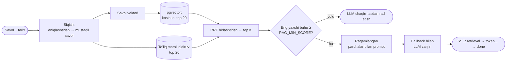

# SkyDental — stomatologiya klinikasi uchun RAG yordamchisi

[English](README.md) · **Oʻzbekcha** · [Русский](README.ru.md)

**Retrieval-Augmented Generation (RAG)** haqidagi oʻquv loyihasi: javob topilgan hujjatlarga
tayanib yaratiladi. Bu Toshkentdagi stomatologiya klinikasining rus va oʻzbek tilidagi
lendingi. Undagi chat-yordamchi **faqat klinikaning bilimlar bazasi boʻyicha** javob beradi. Chat
qidiruvning har bir qadamini koʻrsatadi: qaysi parchalar qanday baho bilan topildi, ulardan qaysilari
promptga tushdi, qaysi model javob berdi va boshqa modelga oʻtishga toʻgʻri keldimi.

| Qatlam | Nima ishlatilgan |
| --- | --- |
| Frontend | Vite 7, React 19, TypeScript; RU va UZ; yorugʻ va qorongʻi mavzu; tashqi rasm va veb-shriftlarsiz |
| Backend | [Hono](https://hono.dev) asosida Node va TypeScript, bitta Vercel funksiyasi (`/api/*`) |
| Maʼlumotlar bazasi | pgvector bilan Postgres: prodakshnda [Neon](https://neon.tech), lokal ishda ichki [PGlite](https://pglite.dev) (Docker va bulutsiz) |
| LLM | Avtomatik zaxira modelga oʻtadigan provayderlar qatlami. Standart — Gemini, **faqat yengil modellar** (minimal reasoning bilan Flash-Lite va Flash). OpenAI, OpenRouter, Groq, DeepSeek, Anthropic va Ollama bitta muhit oʻzgaruvchisi bilan ulanadi |
| Admin panel | Baholar va izlar (trace), bazadagi boʻshliqlar, statistika, versiyalar va eksportli baza muharriri, modellar holati, qidiruv qumdoni |
| Eval | 35 ta namunaviy savol; hit@k, MRR, rad etish aniqligi; chegarani tanlash; xohishga koʻra LLM-hakam |

## Mundarija

- [Chatda RAG qanday koʻrinadi](#chatda-rag-qanday-koʻrinadi)
- [Pipeline qanday ishlaydi](#pipeline-qanday-ishlaydi)
- [Tez boshlash](#tez-boshlash)
- [Muhit oʻzgaruvchilari](#muhit-oʻzgaruvchilari)
- [LLM provayderlari va fallback](#llm-provayderlari-va-fallback)
- [Admin panel](#admin-panel)
- [Eval](#eval)
- [Vercel va Neonʼga joylash](#vercel-va-neonʼga-joylash)
- [Loyiha tuzilmasi](#loyiha-tuzilmasi)
- [Bilimlar bazasi](#bilimlar-bazasi)
- [Klinika maʼlumotlari](#klinika-maʼlumotlari)
- [Dizayn va harakat](#dizayn-va-harakat)

## Chatda RAG qanday koʻrinadi

*«Implant qancha turadi?»* deb soʻrang. Javob yozilish jarayonida, raqamlangan havolalar `[1]`,
`[2]` bilan keladi. Havolani bossangiz, iqtibos va uning manbasi chiqadi.

Har bir javob ostida **«Javobni qanday topdim»** paneli bor:

| Nima koʻrinadi | Bu nimani anglatadi |
| --- | --- |
| Asl va qayta yozilgan savol | *«U qancha turadi?»* kabi aniqlashtiruvchi savollar qidiruvdan oldin mustaqil savolga aylantiriladi |
| vector, text va RRF baholari va «promptda» belgisi bilan top-k parchalar | Maʼno va soʻzlar boʻyicha gibrid qidiruv, Reciprocal Rank Fusion orqali birlashtirilgan |
| Yaqinlik chegarasi va eng yaxshi moslik | Chegaradan past boʻlsa, bot LLMʼni umuman chaqirmay rad etadi |
| Model, fallback urinishlari, vaqt, tokenlar | Qaysi model javob berdi va undan oldin nima boʻldi |

**Talaba rejimi** (chat sarlavhasidagi almashtirgich) izni toʻliq ochadi va tugma qoʻshadi:
*«Xuddi shu modeldan bilimlar bazasisiz soʻrash»*. Ikkinchi javob birinchisining ostida chiqadi va
ularni solishtirish mumkin: RAGsiz model odatda narxlarni oʻzi toʻqib chiqaradi.

Rad etishda sabab koʻrsatiladi, masalan: *«Eng yaxshi moslik 0.41 chegara 0.60 dan past: bazada mos
parcha yoʻq.»*

👍 va 👎 baholari bazaga saqlanadi; 👎 dan keyin izoh qoldirish mumkin. Admin panelda ular shu
javobning toʻliq izi yonida koʻrinadi.

## Pipeline qanday ishlaydi



1. **Indekslash** (`server/rag/ingest.ts`). `shared/chunker.ts` markdown hujjatlarni boʻlaklarga
   ajratadi. Bitta `## boʻlim` — bitta boʻlak, jadvalning bitta qatori ham bitta boʻlak: shunda
   narxlar roʻyxatining har bir qatori alohida topiladi. Har bir boʻlakning *embedding modeli +
   matn* xeshi bor. Hujjat saqlanganda vektorlar faqat xeshi yangi boʻlaklar uchun qayta
   hisoblanadi: bitta narx tuzatilsa, butun roʻyxat emas, bitta vektor qayta hisoblanadi.
   Embeddinglar — `gemini-embedding-001`, 768 oʻlcham.
2. **Savolni siqish** (`server/rag/answer.ts`). Chatda tarix boʻlsa, yengil model aniqlashtiruvchi
   savolni mustaqil savolga qayta yozadi. Qidiruv va prompt qayta yozilgan savol bilan ishlaydi, izda
   ikkala variant ham koʻrinadi.
3. **Gibrid qidiruv** (`server/rag/retrieve.ts`). Ikkala til boʻyicha bitta SQL soʻrov: vektorli
   qidiruv (kosinus, top 20) va soʻz oʻzaklari boʻyicha Postgres toʻliq matnli qidiruvi (top 20),
   RRF (k = 60) orqali birlashtiriladi. RRF «xom» baholarni emas, oʻrinlarni qoʻshadi: ikki
   qidiruvning shkalalari har xil. Oʻzbekcha savol ruscha parchani topadi. Ikki kichik bonus teng
   oʻrinlarni ajratadi: savol tilidagi parchalar va savol narx haqida boʻlsa, narxlar roʻyxati.
4. **Chegara.** Eng yaxshi kosinus yaqinligi `RAG_MIN_SCORE` dan past boʻlsa, bot darhol rad etadi va
   ikkala sonni aytadi.
5. **Prompt** (`server/rag/prompt.ts`). Koʻrsatma foydalanuvchi tilida: faqat raqamlangan
   parchalar boʻyicha javob berish, `[n]` havolalarini qoʻyish, javob boʻlmasa `NO_ANSWER` belgisini
   qaytarish.
6. **Generatsiya** modellar zanjiri (`server/llm/chain.ts`) orqali oqim bilan boradi.
7. **Protokol** (`shared/protocol.ts`). Chat Server-Sent Events oladi: `retrieval`, keyin `token`
   hodisalari, keyin iz id, manbalar, model, urinishlar, vaqt va tokenlar sarfi bilan `done`. Xato
   boʻlsa, `done` oʻrniga `error` keladi.
8. **Izlar.** Har bir savol `chat_traces` ga, har bir baho `feedback` ga yoziladi. IP-manzillar
   saqlanmaydi: soʻrovlar limiti uchun faqat tuzli xesh qoladi.

## Tez boshlash

Node.js 22 yoki undan yangisi kerak.

```bash
npm install
cp .env.example .env
```

Loyihani uch usulda ishga tushirish mumkin.

### A. Brauzerda demo, serversiz

`.env` da `VITE_RAG_ENDPOINT=` ni boʻsh qoldiring va `npm run dev:web` ni ishga tushiring. Chat
brauzerning oʻzida xuddi shu markdown fayllar boʻyicha oddiy soʻz mosligi bilan javob beradi.
Hodisalar va iz bir xil, chatda «Demo rejim» belgisi koʻrinadi.

### B. Butun stek oflayn, kalitlarsiz

`.env` ga yozing:

```ini
LLM_CHAIN=local:extractive
EMBED_PROVIDER=local
EMBED_MODEL=hash-768
RAG_MIN_SCORE=0.15
ADMIN_PASSWORD=admin
```

Keyin bazani indekslang va sayt bilan APIʼni ishga tushiring:

```bash
npm run seed
npm run dev
```

Sayt http://localhost:5173 da, API http://localhost:8787 da (Vite `/api` ni oʻsha yerga
yoʻnaltiradi), admin panel http://localhost:5173/admin.html da ochiladi. `local` provayderi eng mos
parcha bilan javob beradi, `hash-768` esa oʻyinchoq embeddinglar. Bu rejim interfeys ustida ishlash
uchun qulay, lekin javoblar sifatini baholash uchun emas.

### C. Gemini bilan

[Google AI Studio](https://aistudio.google.com/apikey) da kalit oling va uni `.env` dagi
`GEMINI_API_KEY` ga yozing. `LLM_CHAIN` va `EMBED_*` ni standart holida qoldiring, keyin:

```bash
npm run seed
npm run dev
```

> **PGlite bitta jarayonda ishlaydi.** Lokal bazada `npm run seed` yoki `npm run eval` dan oldin
> `npm run dev` ni toʻxtating. Neonʼda bunday cheklov yoʻq.

### Buyruqlar

| Buyruq | Nima qiladi |
| --- | --- |
| `npm run dev` | Vite va API birga (`dev:web` va `dev:api` ularni alohida ishga tushiradi) |
| `npm run build` | Frontend va server turlarini tekshiradi, keyin `dist/` ga yigʻadi |
| `npm run db:migrate` | `server/db/schema.sql` ni `DATABASE_URL` dagi bazaga qoʻllaydi |
| `npm run seed` | `content/rag/{ru,uz}/*.md` ni bazaga yuklaydi va indekslaydi. Bazada allaqachon bor hujjatlarga tegmaydi |
| `npm run seed -- --force` | Hujjatlarni fayllar mazmuni bilan qayta yozadi. Har bir qayta yozish — yangi versiya, eskilari tarixda qoladi |
| `npm run seed -- --reindex` | Barcha hujjatlar indeksini qayta quradi, masalan `EMBED_MODEL` almashtirilgandan keyin |
| `npm run eval` | Namunaviy toʻplamda qidiruv koʻrsatkichlari. [Eval](#eval) ga qarang |

## Muhit oʻzgaruvchilari

Barcha oʻzgaruvchilar [`.env.example`](.env.example) da tasvirlangan. Asosiylari:

| Oʻzgaruvchi | Standart qiymat | Vazifasi |
| --- | --- | --- |
| `VITE_RAG_ENDPOINT` | `/api/chat` | Chat savollarni qayerga yuboradi. Boʻsh — brauzerda demo rejim. **Yigʻish** paytida oʻqiladi |
| `DATABASE_URL` | boʻsh | Neon ulanish satri (pooled). Boʻsh — `.data/` dagi PGlite, faqat lokal ishda |
| `GEMINI_API_KEY` va boshqa `*_API_KEY` | boʻsh | Provayder faqat kaliti berilganda ulanadi |
| `OLLAMA_BASE_URL` | boʻsh | Lokal Ollama, masalan `http://localhost:11434/v1` |
| `LLM_CHAIN` | Gemini Flash-Lite → Flash-Lite → Flash | Ustuvorlik tartibidagi modellar zanjiri: `provider:model,provider:model` |
| `GEMINI_THINKING_LEVEL` | `minimal` | Gemini 3 reasoning darajasi: `minimal`, `low` yoki `off` |
| `EMBED_PROVIDER`, `EMBED_MODEL` | `gemini`, `gemini-embedding-001` | Embeddinglar. Almashtirilgandan keyin qayta indekslash kerak |
| `RAG_TOP_K` | `5` | Promptga nechta parcha tushadi |
| `RAG_MIN_SCORE` | `0.6` | Rad etish uchun yaqinlik chegarasi. `npm run eval` bilan tanlanadi |
| `ADMIN_PASSWORD` | boʻsh | Admin panel paroli. Boʻsh — admin panel oʻchiq |
| `ADMIN_SECRET` | hosil qilinadi | Admin cookie imzosi uchun sir. Yaratish: `openssl rand -hex 32` |
| `IP_SALT` | ishlab chiqish qiymati | IP xeshi uchun tuz. Prodakshnda oʻzingiznikini bering |
| `RATE_LIMIT_MAX`, `RATE_LIMIT_WINDOW_SEC` | `20`, `600` | Bitta IPʼdan oyna davomida chatga nechta savol berish mumkin |

## LLM provayderlari va fallback

`LLM_CHAIN` modellarni ustuvorlik tartibida sanab oʻtadi. Soʻrov birinchi mavjud modelga ketadi va
model uddalay olmasa, zanjir boʻylab pastga tushadi:

| Nima boʻldi | Zanjir nima qiladi |
| --- | --- |
| 429, 5xx, «overloaded», taymaut (birinchi tokengacha 15 s) | Keyingi modelni sinaydi. Yiqilgan model 60 s yoki `Retry-After` aytgancha dam oladi |
| 401 yoki 403 | Butun provayderni 10 daqiqaga pauza qiladi |
| Provayderda bunday model yoʻq | Modelni bir soatga pauza qiladi. Zanjir provayderning modellar roʻyxatini ham tekshiradi (kesh bir soat) |
| 400 yoki soʻrovning oʻzidagi boshqa xato | Xatoni fallbacksiz qaytaradi: keyingi model ham xuddi shunday yiqilardi |

Boshqa modelga faqat **birinchi tokengacha** oʻtish mumkin. Model javob bera boshlab uzilib qolsa,
chat xato oladi: javobni ikki modeldan yopishtirib boʻlmaydi. Pauzalar funksiya xotirasida
saqlanadi. Har bir urinish izga (`attempts`) tushadi, admin panelda esa har bir modelning holati
koʻrinadi va **«Ping»** tugmasi bor.

Zanjirda provayderlarni aralashtirish mumkin, masalan Gemini bepul kvotasi tugab qolgan holat uchun:

```ini
LLM_CHAIN=gemini:gemini-3.5-flash-lite,gemini:gemini-3.5-flash,groq:llama-3.1-8b-instant
```

Model nomlari tez-tez oʻzgaradi. Ularni provayder roʻyxati bilan solishtiring va admin paneldagi
**«Ping»** tugmasi bilan har birini tekshiring.

Kalitlarsiz fallbackni koʻrish: `LLM_CHAIN=local:fail-429,local:extractive`. Birinchi model doim
yuklama haqida xabar beradi, ikkinchisi javob beradi, izda esa ikkala urinish koʻrinadi.

Yana bitta OpenAI bilan mos provayder qoʻshish uchun `server/llm/registry.ts` ga bitta yozuv
qoʻshing: API manzili va kalit saqlanadigan oʻzgaruvchi.

## Admin panel

Admin panel lokal ishda `/admin.html`, Vercelʼda `/admin` manzilida ochiladi. Bu Viteʼning alohida
kirish nuqtasi, u lendingni ogʻirlashtirmaydi. Parol `ADMIN_PASSWORD` da beriladi. Sessiya — HMAC
imzoli httpOnly-cookie, 7 kun amal qiladi.

| Boʻlim | Unda nima bor |
| --- | --- |
| Dialoglar va baholar | Filtrlar bilan barcha savollar: baholangan, 👎, 👍, izohli, javobsiz; RAG yoki RAGsiz rejim. Bosilganda — toʻliq iz |
| Bazadagi boʻshliqlar | Bot javob topa olmagan savollar, umumiy soʻz oʻzaklari boʻyicha guruhlangan, «Bazaga qoʻshish» tugmasi bilan |
| Statistika | 👍 ulushi, rad etishlar ulushi, modellar boʻyicha javoblar, fallback holatlari, p50 va p95 kechikish |
| Bilimlar bazasi | Tillar boʻyicha hujjatlar va boʻlaklarga ajratishning jonli koʻrinishi bilan markdown muharriri. Saqlash yangi versiya yaratadi va faqat oʻzgargan boʻlaklarni qayta indekslaydi. Diff va orqaga qaytarishli versiyalar tarixi, `.md` yoki `.zip` ga eksport |
| Modellar | Zanjir, har bir modelning holati va pauzasi, «Ping», embeddinglar holati va «Hammasini qayta indekslash» |
| Qumdon | Savol berib, javob yaratmasdan qidiruv va tayyor promptni koʻrish. Darsda qulay |

## Eval

`eval/golden.json` da 35 ta savol bor: ruscha, oʻzbekcha, tillararo (savol bir tilda, javob boshqa
tildagi hujjatda), tarixli aniqlashtiruvchi savollar va ataylab bazada yoʻq savollar. Har bir savolda
kutilgan manbalar yoki `expectRefusal` koʻrsatilgan.

```bash
npm run eval                                      # faqat qidiruv, javoblar yaratilmaydi
npm run eval -- --judge                           # javoblar ham yaratiladi, ularni LLM-hakam baholaydi
npm run eval -- --judge=gemini:gemini-3.5-flash   # hakam — aniq model
```

Hisobot konsolga va `eval/report.md` ga chiqadi:

- **hit@k** — kerakli parcha birinchi k ta ichida topilgan savollar ulushi;
- **MRR** — birinchi kerakli parcha oʻrniga teskari qiymatning (1 / oʻrin) oʻrtachasi;
- **rad etish aniqligi** — bazada yoʻq savollar rad etilgan, bazadagi savollarga javob berilgan;
- **chegarani tanlash** — 0 dan 1 gacha har bir `RAG_MIN_SCORE` uchun aniqlik va tavsiya etilgan
  qiymat;
- **hakam** — javob parchalarga tayanadimi (*faithful*) va savolga javob beradimi (*relevant*).

Eval server bilan bir xil baza va bir xil embedding modeli bilan ishlaydi, shuning uchun avval
`npm run seed`. Oflayn `hash-768` embeddinglarida raqamlar faqat tutun testi sifatida yaraydi.
Haqiqiy sifatni Gemini bilan oʻlchang.

## Vercel va Neonʼga joylash

1. **Neon.** [neon.tech](https://neon.tech) da loyiha yarating va **pooled** ulanish satrini nusxalang.
   pgvector kengaytmasini sxemaning oʻzi yaratadi.
2. **Sxema va maʼlumotlar.** Bir marta oʻz kompyuteringizdan:

   ```bash
   DATABASE_URL="postgres://…" npm run db:migrate
   DATABASE_URL="postgres://…" GEMINI_API_KEY=… npm run seed
   ```

   Yoki xuddi shu qiymatlarni `.env` ga yozib, `npm run db:migrate` va `npm run seed` ni ishga
   tushiring.
3. **Vercel.** Repozitoriyni import qiling. `vercel.json` da Vite yigʻishi, natija papkasi va
   `/api/*` ni bitta funksiyaga (`api/index.ts`, 60 s gacha) yoʻnaltirish allaqachon berilgan.
4. **Muhit oʻzgaruvchilari** *Project Settings → Environment Variables* da beriladi: `DATABASE_URL`,
   `GEMINI_API_KEY`, `VITE_RAG_ENDPOINT=/api/chat`, `ADMIN_PASSWORD`, `ADMIN_SECRET` va `IP_SALT`,
   oʻzgartirgan boʻlsangiz `LLM_CHAIN` va `RAG_MIN_SCORE` ham. `VITE_RAG_ENDPOINT` yigʻish paytida
   kodga kiritiladi, shuning uchun uni oʻzgartirgandan keyin qayta deploy kerak.
5. **Tekshirish:** `https://<loyiha>.vercel.app/api/health`. U yerda baza, boʻlaklar soni, qayta
   indekslash kerakmi, ulangan provayderlar va zanjir holati koʻrinadi. Keyin chatni va `/admin`
   manzilidagi admin panelni oching.

Vercelʼda sxema oʻzi qoʻllanmaydi. `schema.sql` har safar oʻzgarganda `npm run db:migrate` ni ishga
tushiring.

## Loyiha tuzilmasi

```
api/index.ts            Vercel kirish nuqtasi: barcha /api/* soʻrovlari Honoʼga ketadi
server/
├── app.ts              /api/chat (SSE), /api/feedback, /api/health, /api/admin/*
├── dev.ts, env.ts      lokal API server; muhit oʻzgaruvchilarini tekshirish (zod)
├── db/                 schema.sql va klient: postgres.js (Neon) yoki PGlite
├── llm/                provayderlar (gemini, openaiCompat, anthropic, local), reestr, fallback zanjiri
├── rag/                ingest, retrieve, prompt, answer — RAG pipeline
├── admin/              admin panel marshrutlari, kirish, zip eksport
└── rateLimit.ts
shared/                 frontend va server uchun umumiy kod
├── chunker.ts          markdown → boʻlaklar (demo-bot, server va admin paneldagi koʻrinish)
├── protocol.ts         soʻrov, SSE hodisalari va iz turlari
└── sse.ts, text.ts     SSE tahlili; soʻzlar boʻyicha qidiruv uchun soʻz oʻzaklari
scripts/                migrate, seed, eval
eval/golden.json        eval uchun savollar
content/rag/{ru,uz}/    boshlangʻich bilimlar bazasi (seed)
src/
├── components/chat/    ChatWidget, useChat, ragClient, RetrievalTrace, AnswerText, demo-bot
├── admin/              admin panel (alohida kirish nuqtasi admin.html)
├── i18n/               ru.ts, uz.ts — saytning barcha matnlari
├── styles/, graphics/  tokenlar, boʻlimlar, shisha; girih naqshi, toj, ikonkalar
├── theme/              yorugʻ, qorongʻi va avto
└── config.ts           Telegram va xarita havolalari
```

## Bilimlar bazasi

Boshlangʻich maʼlumotlar oddiy markdownʼda:

```
content/rag/
├── ru/{prices,faq,schedule}.md
└── uz/{prices,faq,schedule}.md
```

`npm run seed` bu fayllarni bazaga yuklaydi. Shundan keyin **haqiqat manbai — baza**. Bilimlar
bazasini admin panelda tahrirlang: har bir saqlash versiyaga aylanadi va unga qaytish mumkin.
Fayllarni olish uchun eksportdan foydalaning. Takroriy `npm run seed` `--force` berilmasa, bazada
allaqachon bor hujjatlarga tegmaydi.

Boʻlaklarga ajratish ikki tuzilmaga tayanadi:

- `# Sarlavha` — hujjat nomi, manba yozuviga kiradi;
- `## Boʻlim` — bitta boʻlak;
- **jadval qatori** — alohida boʻlak, birinchi ustun manba yozuviga kiradi. Narxlar roʻyxati uchun
  bu muhim: aks holda barcha pozitsiyalar bitta boʻlakka yopishib qolardi.

`schedule.md` dagi telefon, uy va qavat — saytdagi kabi `__` toʻldirgichlari: bot sahifada yoʻq
raqamni aytmaydi.

## Klinika maʼlumotlari

Matnlar, narxlar, telefon va manzil `src/i18n/ru.ts` va `src/i18n/uz.ts` da. Ikkala faylni ham
oʻzgartiring. Kalitni bitta lugʻatga qoʻshib, ikkinchisini unutsangiz, `npm run build` xato beradi
va tarjima qilinmagan matn saytga chiqmaydi.

| Nima | Qayerda |
| --- | --- |
| Telegram va xarita havolalari | `src/config.ts` |
| SEO: manzil, telefon, ish vaqti | `index.html` dagi JSON-LD bloki va meta-teglar |
| Chat-bot javoblari | bilimlar bazasi (admin panel yoki birinchi seedʼgacha `content/rag/`) |

> Hozir barcha raqamlar — **toʻldirgichlar**: narxlar, ochilgan yil, reyting. Nashr qilishdan oldin
> ularni haqiqiysiga almashtiring.

Uchta maydon ataylab ishonarli qiymatlarsiz qoldirilgan, toki ularni haqiqiy deb oʻylab
boʻlmasin. Saytda ularning ostida punktir chiziq va «demo maʼlumot» izohi bor:

| Maydon | Lugʻatdagi kalit | Nima qilish kerak |
| --- | --- | --- |
| Manzilning oxiri | `contacts.address` | `__` oʻrniga uy va qavatni qoʻying |
| Telefon | `contacts.phone` va `contacts.phoneHref` | koʻrinadigan raqam va `tel:` uchun raqamlar |
| Litsenziya raqami | `footer.license` | `__-____` oʻrniga raqam |

`phoneHref` boʻsh ekan, `components/PhoneLink.tsx` telefonni **havola emas, matn** sifatida
koʻrsatadi: aks holda `tel:` hech qayerga olib bormasdi. Raqamlar paydo boʻlishi bilan toʻrtala joy
oʻzi havolaga aylanadi.

**Qabulga yozilish shakli.** Yozilish uchun backend hozircha yoʻq. Shakl ism va telefonni (`+998` va
9 raqam) tekshiradi, arizani buferga nusxalaydi va klinikaning Telegramini ochadi. Endpoint paydo
boʻlganda `components/Contacts.tsx` dagi `onSubmit` tanasini `fetch()` bilan almashtiring.

## Dizayn va harakat

Dizayn vebga moslashtirilgan Apple Human Interface Guidelines asosida qurilgan
([apple-design](https://github.com/dickwu/apple-design-skill) skili):

- **Palitra.** Oʻzbek sirlangan majolikasining kobalt va feruza ranglari: koshin siri va dental
  chinni aslida bitta material. Kontrast haqiqiy hex qiymatlardan WCAG boʻyicha hisoblangan: asosiy
  matn 17.4:1, ikkinchi darajali matn va aksent 5.9:1. Feruza (3.1:1) faqat grafikada.
- **Shisha** faqat funksional qatlamda: sarlavha va chat paneli. Kontent kartalari zich.
- **Mavzu.** Avto (tizim boʻyicha), yorugʻ yoki qorongʻi. Tanlov `localStorage` da saqlanadi va
  birinchi chizishdan oldin qoʻllanadi, shuning uchun miltillash yoʻq.
- **Girih naqshi** butun sahifa ostida. Qahramon blok ostida u toʻliq kuchda, pastroqda — yengil
  faktura. Koshinlar aylantirish tezligining 0.15 qismi bilan harakatlanadi — parallaksning uzoq
  rejasi (scroll-driven animations).
- **Harakat.** Segmentli almashtirgichlarda taglik prujinada sirpanadi (`linear()`). Yangi mavzu
  tugmadan doira boʻlib ochiladi (View Transitions). FAQ javoblari balandlik boʻyicha ochiladi va
  yopiladi (`interpolate-size`). Sarlavha aylantirishning birinchi 96 px ida «oʻtiradi». Qahramon
  blok qatorlari va boʻlim kartalari navbat bilan paydo boʻladi. Chat oʻz tugmasidan prujinada
  oʻsib chiqadi.
- **Qulaylik.** Sayt «harakatni kamaytirish», «shaffoflikni kamaytirish» va «kontrastni oshirish»
  sozlamalarini hisobga oladi. Bosish nishonlari kamida 44 px, klaviatura fokusi koʻrinadi, chat —
  fokus tuzogʻi bilan `Esc` orqali yopiladigan modal oyna.
